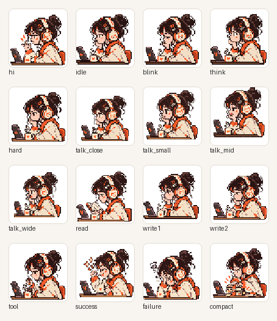
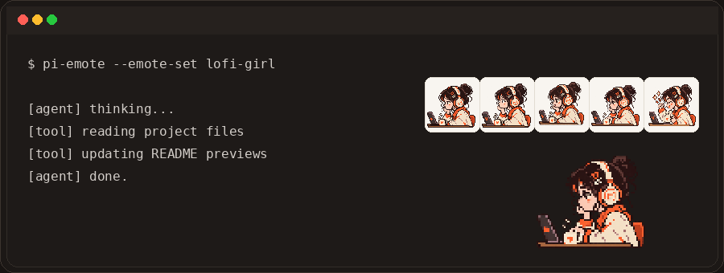

# pi-emote Lo-Fi Girl

A Lo-Fi-inspired pixel-art emote set for [`cgxeiji/pi-emote`](https://github.com/cgxeiji/pi-emote).

## Preview

### Hero


### State overview


### Example terminal-style preview


## Included states

- `hi`
- `idle`
- `think`
- `talk`
- `read`
- `write`
- `tool`
- `success`
- `failure`
- `compact`

## Use

Copy `emotes/lofi-girl/` into one of pi-emote's emote search locations, for example:

```text
~/.pi/agent/extensions/pi-emote/emotes/lofi-girl/
```

Then map it in your pi-emote config:

```json
{
  "emotes": [
    { "model": "*", "emote-set": "lofi-girl" }
  ]
}
```

## Notes

- All state PNGs are 64x64 with a consistent 1px transparent border.
- PNGs have been re-encoded cleanly.
- The talk frames are unique: `talk_close`, `talk_small`, `talk_mid`, `talk_wide`.
- The write animation frames are unique: `write1`, `write2`.
- `idle` and `think` use `emotes.json` to map default and alternate frames.
